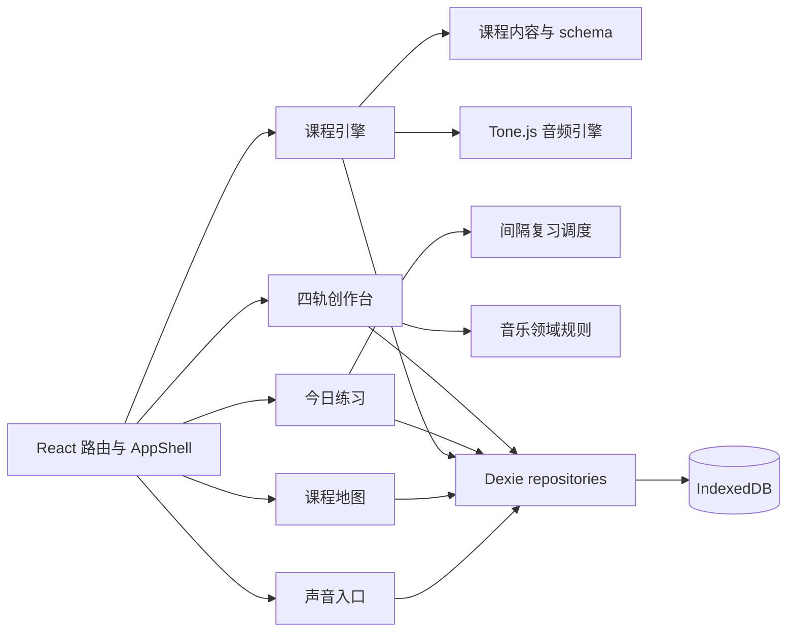

# MusicStudy

MusicStudy 是一个浏览器端音乐学习 MVP。它把“先听见、再理解、最后创作”串成一条可玩的学习航线：学习者从中央 C 出发，在八个课程节点中建立音高、节奏、键盘、音阶与和弦能力，再通过今日练习巩固薄弱项，并把知识带入八小节四轨创作台。

## 当前 MVP

- 首访声音入口与可探索的音乐群岛地图
- 八个内容驱动课程节点、分层反馈、提示、三次错误后的变式题与星级结算
- 最多六项的今日练习与 1/3/7/14 天间隔复习
- 鼓、贝斯、和弦、旋律四轨八小节创作台，支持撤销、重做、键盘微调与规则提示
- 本地学习进度、尝试记录、复习计划与作品持久化
- 桌面、触控、键盘和减少动效路径

## 启动与验证

要求 Node.js 18+ 和 npm。

```powershell
npm install
npm run dev
```

开发服务器默认由 Vite 提供。生产构建和完整检查：

```powershell
npm run lint:copy
npm run typecheck
npm test
npm run build
npx playwright install chromium
npm run test:e2e
```

端到端套件在 1440×1000 桌面视口与 390×844 移动视口运行，保留失败 trace。音频测试断言引擎调用和界面播放状态，不比较声波。

## 模块



核心目录：

- `src/content`：课程 schema、世界地图与逐课内容
- `src/features`：首页、地图、课程、练习、能力轨道与创作台 UI
- `src/domain/music`：音高、节奏、音阶、和弦及作品规则
- `src/audio`：Tone.js 音频生命周期与播放调度
- `src/data`：Dexie 数据库和 repository 边界
- `src/stores`：跨页面学习进度状态

## 扩展课程内容

1. 在 `src/content/lessons` 新增一个满足 `Lesson` schema 的课程文件。
2. 为课程安排稳定 `id`、所属 `worldId`、顺序、经验值、前置课程和步骤。
3. 每个步骤声明 `type`、提示文案、能力 `skillIds`、配置与针对性的错误反馈。
4. 在 `src/content/worlds.ts` 注册课程并把对应节点标为 `playable`。
5. 补充 schema/内容契约测试，确认答案结构能被对应步骤渲染器完成。

课程不是写死在页面中的流程；`LessonPage` 根据步骤类型选择键盘、节奏格、音阶、和弦或示范渲染器。新增步骤类型时，应同时扩展 schema、答案判定、渲染器与测试。

## IndexedDB 数据

数据库名为 `music-study`，由 Dexie 管理，当前 schema 版本为 1：

- `progress`：本地 XP、连续学习、课程星级与解锁信息
- `attempts`：逐步答题正确性、提示次数和错误码
- `reviews`：各能力掌握度、复习间隔和到期日期
- `compositions`：八小节作品、四轨音符、修订号与更新时间
- `settings`：可扩展的本地设置键值

数据仅保存在当前浏览器配置中；清除站点数据会删除学习记录。作品编辑采用 500ms 防抖自动保存，保存失败时保留内存快照并提供 JSON 下载恢复。

## 路线图与首版边界

实现路线与后续阶段见 [MusicStudy MVP 实施计划](docs/superpowers/plans/2026-07-11-music-study-mvp-implementation.md)。

首版边界：没有账号、云同步、多人协作、MIDI 设备输入、录音、乐谱导入、完整 DAW 混音或服务端推荐；课程与音色包也尚未提供在线编辑器。当前复习算法是固定的 1/3/7/14 天阶梯，所有学习分析均基于本地数据。
